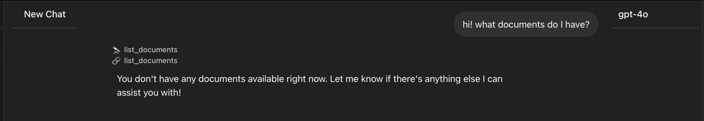
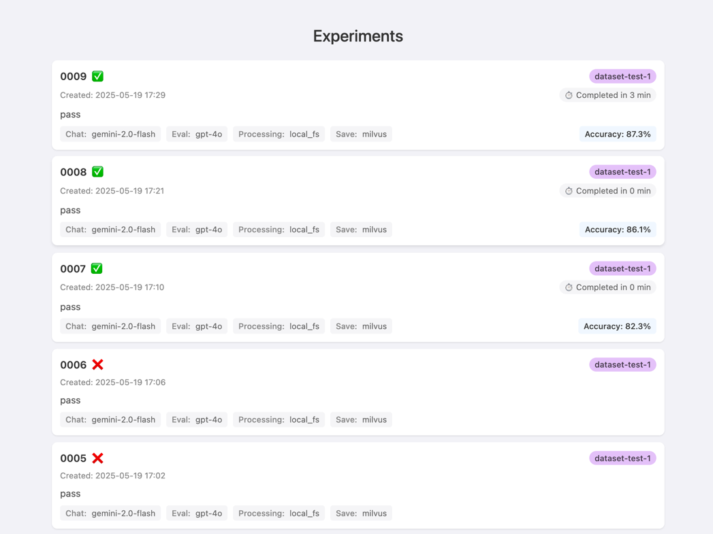

#  Document Search Tools Server

A standalone server that allows users to upload PDF documents and after documents are parsed and processed, users are able to call `/v1/tools-execute`, passing a conversation with pending tool calls. Server answers tool calls, producing new Messages with Results: RAG Messages, Helper Messages, or Text Messages.

Please, visit http://localhost:8011/docs to access the API documentation
All models that endpoints accept or output, are also available.
Documentation is always up-to-date as it's generated on APP's startup.

Hint: in documentation "tick" show Response Schema. If it's too long to read: copy-paste to LLM and ask it to create structures in your language/library

Alternatively, RAW OpenAPI documentation can be accessed at http://localhost/v1/openapi.json -- Useful for alternative API Clients: Yaak, Postman, etc.
## Overview

This application provides a complete pipeline for:
1. Uploading PDF files OR putting PDF files into shared folder
2. Extracting text content from PDFs
3. Processing the extracted content, uploading to OpenAI's File and Vector Store APIs.
4. Providing an API interface to List and Execute Tools

## Features

- **File Management**: Upload, list, and delete PDF files
- **Asynchronous Processing**: Background workers handle resource-intensive tasks
- **Vector Search**: Semantic search capabilities using OpenAI's vector stores
- **Stateful Processing**: Track processing status of documents from upload to completion

## Installation

Download docker-compose-stack.yaml
```bash
wget -O docker-compose-stack.yaml https://raw.githubusercontent.com/COXIT-CO/chat-with-pdf-poc/refs/heads/main/docker-compose-stack.yaml
```

Set in your environment following variables:\
OPENAI_API_KEY and OPENROUTER_API_KEY

[read more about openrouter](https://openrouter.ai/docs/faq) -- a unified API interface to LLMs

verify that:
```sh
printenv | grep -E 'OPENAI_API_KEY|OPENROUTER_API_KEY'
```

Start docker compose
```bash
docker compose -f docker-compose-stack.yaml up -d
```

## Installation, Dev

Clone repository 
```bash
git clone -b eval https://github.com/COXIT-CO/chat-with-pdf-poc.git
```

cd into directory
```sh
cd chat-with-pdf-poc
```

Set in your environment following variables:\
OPENAI_API_KEY and OPENROUTER_API_KEY

[read more about openrouter](https://openrouter.ai/docs/faq) -- a unified API interface to LLMs

verify that:
```sh
printenv | grep -E 'OPENAI_API_KEY|OPENROUTER_API_KEY'
```

Start docker compose
```bash
docker compose -f docker-compose-stack-dev.yaml up -d
```

### Specify Endpoints & API KEY in Chat UI

In your browser open: [http://localhost:5173](http://localhost:5173)
Click on settings, and specify:
#### Section: Connections
API Endpoint: http://localhost:7016/v1

API KEY: admin1234
#### Section: MCPL Servers
Add Server: http://chat-with-pdf-poc:8011/v1

### Head back to Chat

Head back to chat and on "Select Model" select model e.g. gpt-4o

Make a test request: "what documents do I have"?

Expected output:



Telescope Emoji + Tool Name -- means model decided to call tool "Tool Name"

PaperClip Emoji + Tool Name -- means tool call of tool "Tool Name" is completed and results are attached to the chat

Hint: click on those elements to expand them, and view their internals

## Evaluation

Evaluation has a dedicated [README.md](https://github.com/COXIT-CO/chat-with-pdf-poc/tree/eval/src/evaluation)

## Access Evaluation Results in GUI

visit http://localhost:8011/v1/experiments to access interactive view format for finished evaluations


## Technical Details

### Architecture

The application follows a modular architecture with these key components:

1. **FastAPI Web Server**: Handles HTTP requests for file uploads, listing, and chat interactions
2. **Background Workers**: Additional Threads that process files without blocking the web server (CPU/IO intensive tasks)
3. **Repository Layer**: Abstracts database operations for file metadata
4. **PDF Extraction Library**: Custom approaches for extracting structured text from PDFs
5. **OpenAI Integration**: Wrappers around OpenAI's API for vector stores and file uploads

### Storage

- **SQLite Database**: Stores file metadata including:
  - Original and hashed filenames
  - User ID
  - Creation timestamp
  - Processing status
  - Vector store ID
  
- **File System Storage**:
  - Uploaded PDFs stored with hashed filenames
  - Extracted text stored in JSONL format
  - Visualization of highlights of extracted paragraphs (optional, hardcoded in `w_extractor.py`)
  
- **OpenAI Vector Stores**: 
  - Semantic search capabilities using OpenAI's embeddings
  - Enables natural language querying of document content

### Processing Pipeline

1. **Upload Phase**:
   - User uploads a PDF file via the `/v1/file-upload` endpoint OR
     File is put into shared folder and `v1/file-create` is called to mark file to process.
   - File is saved with a hashed filename
   - Database record of a file is created with empty processing status

2. **Extraction Phase**:
   - The extractor worker monitors for new files
   - When a new file is detected, text is extracted from the PDF
   - Extraction uses the coxit library to parse paragraphs and sections, assign highlight coordinates
   - Status is updated to `"extracted"` when complete

3. **Processing Phase**:
   - The processor worker monitors for files with `"extracted"` status
   - Status is updated to `"processing"` during this phase
   - A vector store is created if it does not exist
   - Paragraphs are uploaded as files into OpenAI's File API
   - Those 'files' are assigned to created vector stored
   - Status is updated to `"complete"` when finished
   - Any orphaned files are cleaned up from OpenAI's File and Vector Store APIs.

4. **Query Phase**:
   - User calls tools-execute with given messages in OpenAI format
   - IF messages (after latest user message) contain unanswered tool calls, tools are executed: list_documents or search_in_doc
   - After tools are validated, and then executed, returning tool answer messages in output

### Status Tracking

Files progress through these statuses:
- Empty status: Newly uploaded, awaiting processing
- `"extracted"`: Text has been extracted from the PDF
- `"processing"`: Currently being processed by the processor worker
- `"incomplete"`: Processing was interrupted and needs to be resumed
- `"complete"`: Fully processed
- `"error: [message]"`: An error occurred during processing


## Roadmap TBD
- [ ] Sentence / Smaller parts then paragraphs Highlights (without coords) (~Easy-Moderate)
- [ ] RAG re-ranking (with OR without summarizations) (~Moderate)
- [ ] Documents' summarization pipeline (~Moderate)
- [ ] Other Document Storing Options -- e.g. S3 API (~Moderate)
- [ ] Better PDF object detection using CV Model (~Difficult, Research needed)
- [ ] Non-text PDFs support using CV model for OD, then extraction of text using OCR (~Moderate, after CV Model implemented)
- [ ] Questions about Drawings (~Difficult-Very Difficult, after CV Model implemented)
